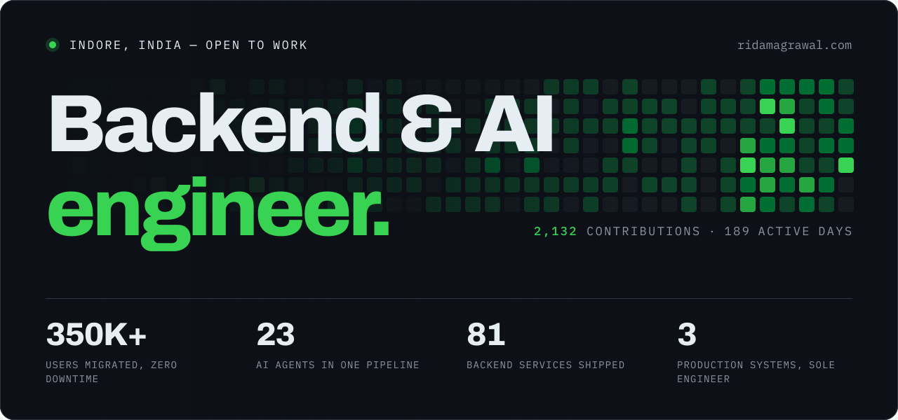
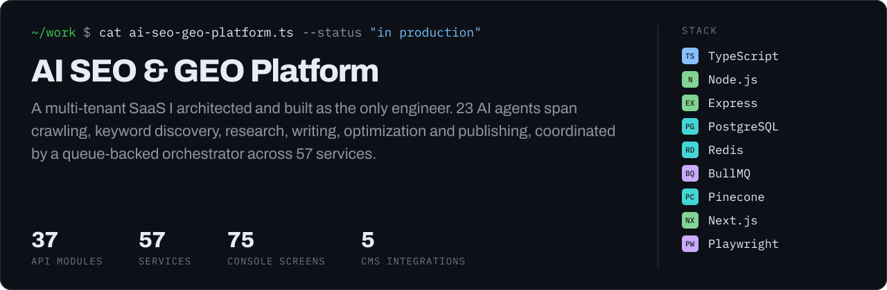
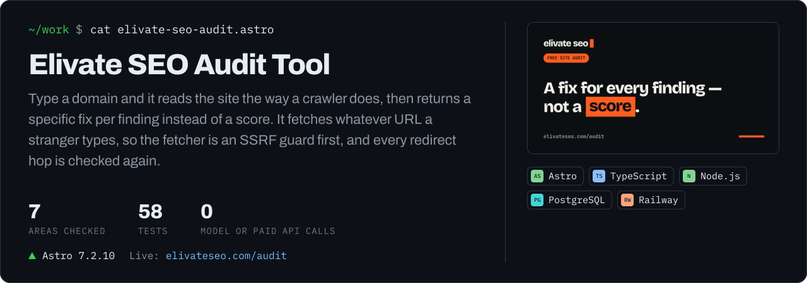
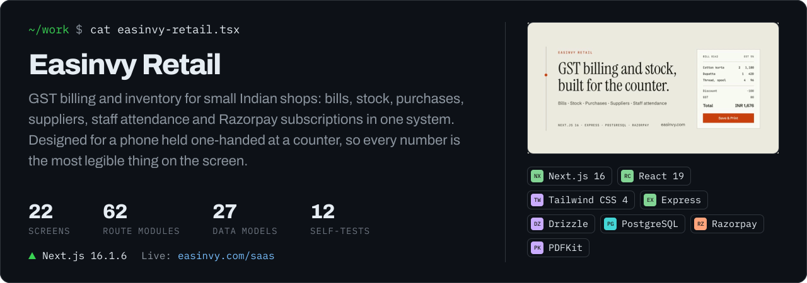
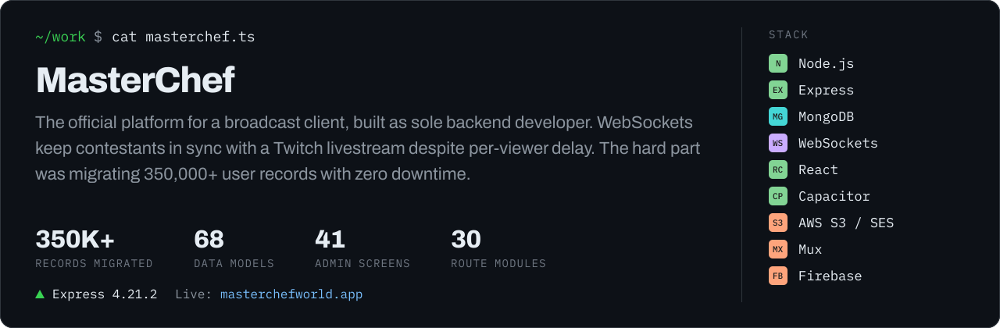
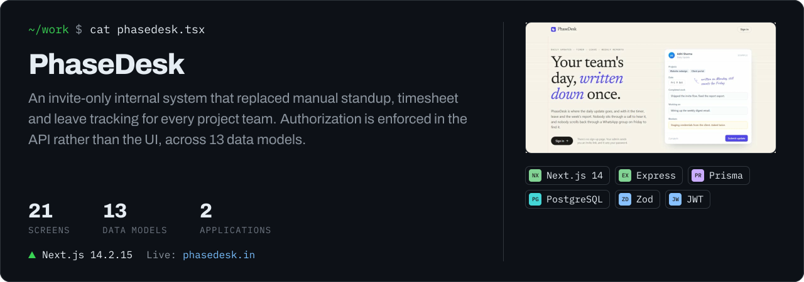
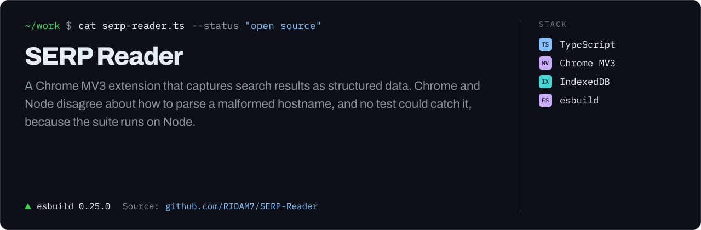
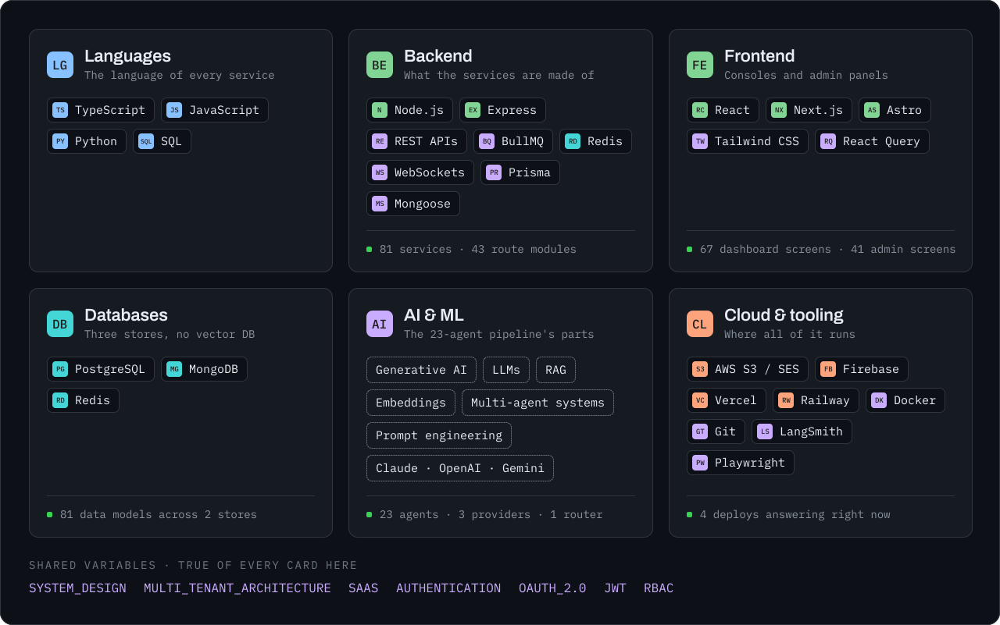
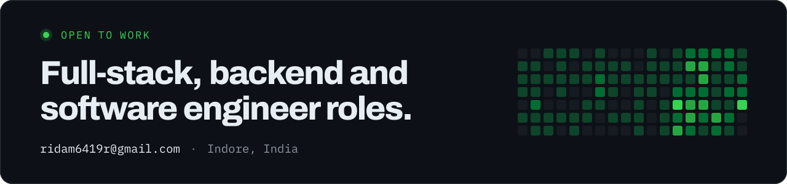

<!--
  Generated by render/render.mjs from render/data.json. Do not edit by hand.

  data.json is exported from ridamagrawal.com's own data files, so this page
  and the site cannot disagree. The contribution grid is fetched live, and a
  workflow re-renders it daily.
-->

Ridam Agrawal is a full-stack developer in Indore with a backend and system-design foundation, working mostly on AI-powered products. Sole engineer on three production systems: a 23-agent multi-tenant SEO platform, the backend for a live broadcast competition app synced over WebSockets, and an internal operations suite. Also runs Elivate SEO, an SEO and GEO firm.

<b><a href="https://ridamagrawal.com">ridamagrawal.com</a></b>&nbsp;&nbsp;·&nbsp;&nbsp;<a href="https://www.linkedin.com/in/ridam-agrawal-a5b6763ab/">LinkedIn</a>&nbsp;&nbsp;·&nbsp;&nbsp;<a href="https://x.com/RIDAM_N7">X</a>&nbsp;&nbsp;·&nbsp;&nbsp;<a href="mailto:ridam6419r@gmail.com">Email</a>&nbsp;&nbsp;·&nbsp;&nbsp;<a href="https://ridamagrawal.com/Ridam_Agrawal_Resume.pdf">Résumé</a>

 

<picture>
  <source media="(prefers-color-scheme: dark)" srcset="assets/head-work-dark.svg">
  
</picture>

 

<picture>
  <source media="(prefers-color-scheme: dark)" srcset="assets/head-experience-dark.svg">
  
</picture>

**Software Developer** · MoonPhase Solutions 
JUN 2026 — PRESENT · INDORE · HYBRID · FULL-TIME

- Architected the company's multi-tenant SaaS for AI-powered SEO and GEO as sole engineer — 37 API modules, 57 backend services and a 75-screen console, with tenant isolation enforced through NextAuth, JWT and RBAC.
- Built a 23-agent pipeline automating keyword research, content generation, optimization and publishing to 5 CMS integrations.
- Routed 3 LLM providers — Claude, OpenAI and Gemini — through a Pinecone RAG layer, selecting per task to balance output quality against latency and API cost.

**Software Developer Intern** · MoonPhase Solutions 
MAR 2026 — MAY 2026 · INDORE · HYBRID · INTERNSHIP

- Sole backend developer for the official MasterChef platform, a live cooking-competition product built for a broadcast client across 30 route modules and 68 data models.
- Engineered real-time event flow over WebSockets keeping contestants synchronized with a Twitch livestream despite per-viewer delay, restoring state on refresh, late join or a second device.
- Migrated 350,000+ user records to the new system with zero downtime and no data loss.

**Freelance Full-Stack Developer** · Black Raven Esports 
JAN 2026 — FEB 2026 · REMOTE · FREELANCE

- Independently delivered a full-stack product for a 30,000+ member esports community, from architecture to deployment in two months.
- Discord and Google OAuth with JWT sessions, plus three core modules — teams, tournaments, scrims — with approval workflows, RBAC, audit logging and a ban system.

 

<picture>
  <source media="(prefers-color-scheme: dark)" srcset="assets/head-stack-dark.svg">
  
</picture>

 

<picture>
  <source media="(prefers-color-scheme: dark)" srcset="assets/head-writing-dark.svg">
  
</picture>

**[Narrowing stops at a function declaration](https://ridamagrawal.com/writing/narrowing-stops-at-a-function-declaration)** 
TypeScript keeps a narrowed type inside an arrow function and loses it inside a hoisted function declaration. Measured across eight compiler versions. 
16 SEPT 2026 · TOOLING · 5 MIN READ

**[Chrome and Node disagree about this URL](https://ridamagrawal.com/writing/chrome-and-node-disagree-about-this-url)** 
The same malformed hostname parses to a clean domain in Node and a punycoded mess in Chrome. A bug no test could catch, because the suite runs on Node. 
06 SEPT 2026 · DEBUGGING · 4 MIN READ

<a href="https://ridamagrawal.com/writing">ALL WRITING ON RIDAMAGRAWAL.COM</a>

 

